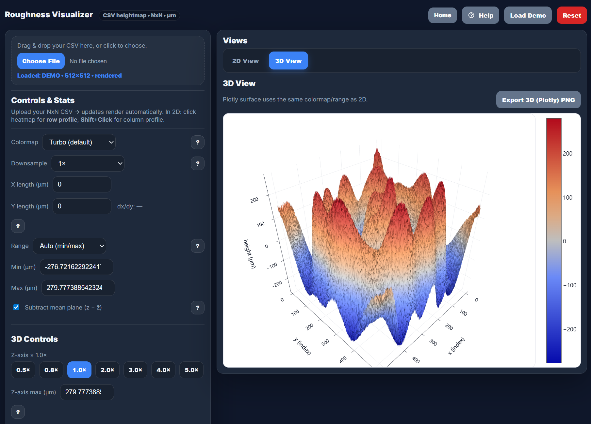

# RoughnessVisualizer

[](https://doi.org/10.5281/zenodo.19678928)

A Web-Based Scientific Roughness Analysis Tool 
Version: 1.1.0

Developer: Dr. James Salveo Olarve  
Affiliation: i-Nano Research Facility, De La Salle University Manila

Live App: https://jamesolarve.github.io/roughnessvisualizer/  
Project Page: https://inanolab.com/roughness.html
Source Repository: https://github.com/JamesOlarve/roughnessvisualizer

---

## Overview

Roughness Visualizer is a browser-based roughness analysis tool for square CSV height maps. It loads surface data locally in the browser, visualizes the dataset in 2D and 3D, and computes common surface roughness metrics in micrometers.

## Screenshot



---

## Intended Users

- Researchers and laboratory personnel
- Graduate and undergraduate students
- Educators and instructors
- Users in materials science, physics, chemistry, biology, and engineering

---

## ✨ Highlights

- Load square height-map CSV files directly in the browser
- Visualize the surface as a 2D heat map, line profile, histogram, and interactive 3D surface
- Compute roughness metrics from the full-resolution dataset
- Adjust display settings such as colormap, downsample factor, range clipping, and 3D Z scaling
- Export plots as PNG and copy metric tables as TSV
- Run entirely client-side with no server-side processing

## 🚀 Quick Start

1. Open [index.html](index.html) in a modern browser.
2. Drag and drop a CSV file onto the page, or choose one manually.
3. Inspect the 2D heat map.
4. Click the heat map to extract a row profile, or use Shift+Click to inspect a column profile.
5. Switch to the 3D view to examine the surface topography interactively.
6. Export plots or roughness metrics when needed.

## 📥 Input Requirements

The tool expects a square numeric dataset representing a height map.

- Shape: the CSV must be an N x N grid
- Accepted separators: comma, tab, or whitespace
- Input values are converted to micrometers for display and reporting
- Metrics are computed from the full-resolution loaded grid after unit conversion

If your measurement data is already in micrometers, verify the unit conversion settings in [index.html](index.html) before using the output in reports.

## 📊 Views And Analysis

### 🗺️ 2D View

- Heat map for quick spatial inspection of surface variation
- Line profile extracted from a selected row or column
- Histogram of height distribution for the displayed dataset

### 🧊 3D View

- Interactive Plotly surface rendering
- Shared colormap and display range with the 2D view
- Adjustable Z-axis scale for clearer topography inspection

## 🎛️ Display Controls

The viewer separates display settings from metric calculations.

- Downsample reduces the rendered grid size for faster display, especially in 3D
- Subtract mean centers the displayed values around the global mean height
- Range mode supports automatic min/max, approximate 1 to 99 percent clipping, or manual limits
- Z-axis scaling changes only the displayed 3D range, not the underlying dataset

Display settings affect visualization, but the roughness metrics remain based on the original loaded data.

## 📐 Roughness Metrics

The application reports the following metrics from the loaded surface data:

- Minimum height, z_min
- Maximum height, z_max
- Mean height, z_bar
- Standard deviation, sigma
- Arithmetic mean roughness, Sa
- RMS roughness, Sq
- Peak-to-valley height, Sz
- Skewness, Ssk
- Kurtosis, Sku

Definitions used by the tool:

- Sa: mean absolute deviation from the mean plane
- Sq: root mean square of height deviation from the mean plane
- Sz: z_max minus z_min
- Ssk: normalized third moment of the height distribution
- Sku: normalized fourth moment of the height distribution

Ssk and Sku are dimensionless and can be sensitive to outliers.

## 💾 Export Options

The application supports exporting analysis outputs for reporting and documentation.

- Heat map PNG
- Line profile PNG
- Histogram PNG
- 3D surface PNG
- Roughness metrics table PNG
- Roughness metrics copied as TSV to the clipboard

## 🛠️ Technology

- Single-file HTML application in [index.html](index.html)
- Plotly for interactive 3D visualization
- html2canvas for metrics table export
- No build tooling or backend required

## 💻 Local Use

You can run the project by opening [index.html](index.html) directly in a browser.

For the best experience:

- Use an up-to-date Chromium, Edge, or Firefox-based browser
- Prefer HTTPS or a secure context if you rely on clipboard behavior
- Increase downsample for very large grids or constrained devices

## ⚠️ Notes And Limitations

- The tool runs fully in the browser; no uploaded data is sent to a server
- Performance depends on dataset size and device graphics capability
- Large 3D surfaces may require higher downsampling because of WebGL limits
- Subtract mean removes the global mean height only; it does not perform full plane fitting or tilt correction


## Run Locally

Because this is a static web application:

```bash
python -m http.server 8000
```

Open:

http://localhost:8000/

---

## Deployment

This project is deployed using GitHub Pages and runs entirely in the browser.

## Maintainer Release Workflow

This repository includes a GitHub Actions workflow at `.github/workflows/release-and-archive.yml` to keep the release metadata synchronized.

When preparing a new version:

1. Mint or reserve the Zenodo version DOI for the release.
2. Run the `Release and Archive` workflow from GitHub Actions.
3. Provide the release version, Zenodo DOI, and citation year.
4. The workflow updates [README.md](README.md) and [CITATION.cff](CITATION.cff), commits the metadata change, creates a Git tag, and optionally publishes a GitHub release.

The workflow uses [scripts/sync-release-metadata.ps1](scripts/sync-release-metadata.ps1) so the DOI badge, README citation text, README version line, and `CITATION.cff` values all stay in sync.

---

## Citation

If you use Roughness Visualizer, please cite:

Olarve, J. S. (2026). *RoughnessVisualizer: A Web-Based Roughness Analysis Tool* (v1.1.0). Zenodo.  
https://doi.org/10.5281/zenodo.19678928

This project now includes a citation metadata file: [CITATION.cff](CITATION.cff)

---

## License

This project is licensed under the MIT License. See [LICENSE](LICENSE).

---

## Disclaimer

This tool is provided “as is” for educational and research use. Validate results against instrument/software standards and your experimental procedure. The developer and institution are not responsible for decisions made based on this tool’s output.

Everything runs locally in your browser (no server processing). Performance depends on N and your device; use Downsample for large grids.

---

## 🏛️ Acknowledgment

Developed by the i-Nano Research Facility,  
De La Salle University Manila.